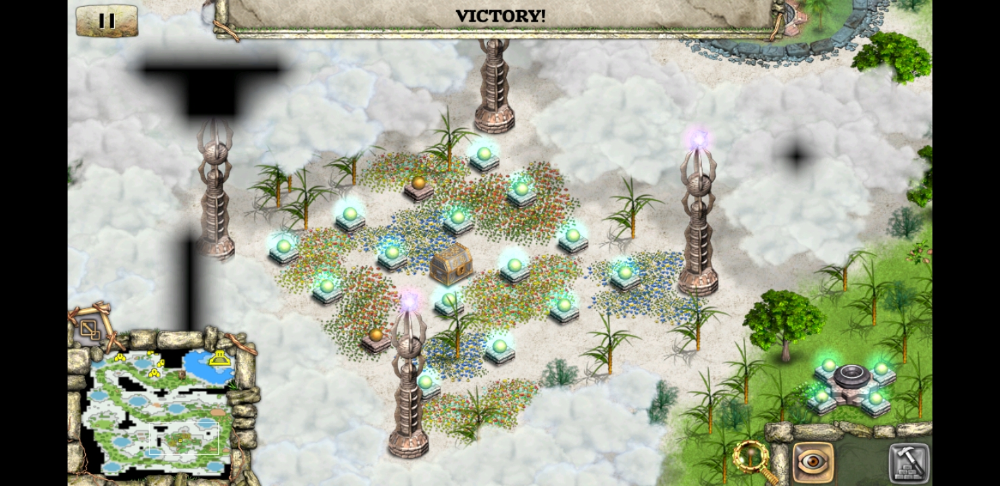

# Light-puzzle-solver

Simple BFS solver for a light puzzle game. You have to turn on all the lights, but when you switch on a specific light, all the lights in the same column and row switch as well.

